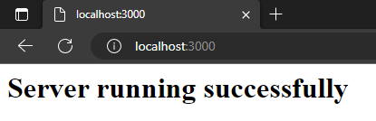

### Node Server Project:

<p>Creates a server on localhost, shows it and displays a JSON with information about the server's RAM usage.</p></br></br>
* Example of local server:

```
http://localhost:3000 
and 
http://localhost:3000/stats 
```


* Example:

index   | value
--------- | ------
OS | operating system
Arch | architecture
TotalRAM | total memory
FreeRAM | free memory
Usage | usage percentage


